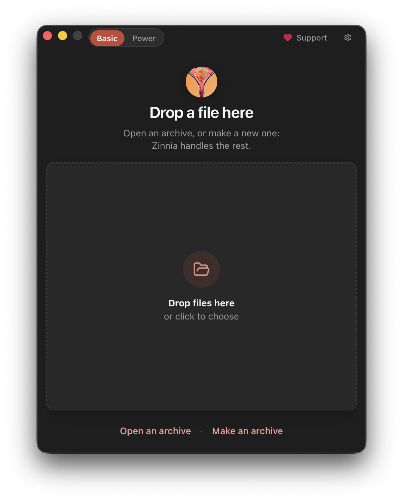

# Zinnia

A cross-platform 7z GUI built with Tauri.

  <table>
    <tr>
      <td valign="middle" align="center" width="220">
        
      </td>
      <td valign="middle" align="center">
        

  
&nbsp;

      </td>
    </tr>
  </table>

See [ARCHITECTURE.md](ARCHITECTURE.md), [CONTRIBUTING.md](CONTRIBUTING.md), and
[SECURITY.md](SECURITY.md).

## System requirements

- macOS 26 or later. The universal build supports Intel and Apple silicon Macs
  that can run macOS 26+.
- Windows 10 version 2004 (build 19041) or later, on x64 or ARM64. The modern
  Explorer integration requires a signed NSIS install.
- Linux x64: Ubuntu 24.04+, Debian 13+, or Fedora 43+ (or a compatible
  distribution with the required WebKitGTK runtime). The public release ships
  x64 AppImage, DEB, RPM, and sideloaded Flatpak bundles; ARM64 packages are
  published only when explicitly built for that release.

## Dev

- `npm install`
- `npm run tauri:dev`
- `cargo doc --manifest-path src-tauri/Cargo.toml`

Direct Cargo commands work without a separate `npm run prepare:7z`; the Tauri
build script refreshes ignored sidecar binaries from tracked assets before the
native build runs.

## OS integration

- Zinnia registers common archive file types in packaged builds.
- Windows NSIS builds add per-user Explorer verbs for `Open with Zinnia`,
  `Extract with Zinnia`, and `Compress with Zinnia` (classic / “Show more options”).
- Signed Windows NSIS builds also register a Win11 modern context menu via a
  **sparse identity MSIX** + `zinnia_shell.dll` (`Zinnia` submenu, plus top-level
  Extract on archives). Zinnia itself stays a normal per-user NSIS Win32 install;
  the MSIX is not a Store/AppX app package; it only grants package identity so
  Explorer can load the shell DLL. See `src-tauri/windows/shell/README.md` and
  `docs/QA-CONTEXT-MENUS.md`.
- Linux `deb`, `rpm`, and Flatpak bundles include desktop `Open`, `Extract`, and
  `Compress` actions.
- macOS users can choose Zinnia from Finder's Open With/Get Info default-app
  flow; Zinnia routes archive launches to the quick extract window. Packaged
  builds also expose Finder Sync context-menu items and Finder Services:
  **Extract with Zinnia** and **Compress with Zinnia**.

## Builds

- Windows: `npm run build:win`
- macOS: `npm run build:mac:universal` then `npm run build:mac:zip`
- Linux: `npm run build:linux`
- Flatpak: `npm run flatpak:bundle`

## Release signing

- `npm run release:sign:gpg`

## Updater setup

- Updater is already configured in `src-tauri/tauri.conf.json`.
- CI runs tests and checks on Linux, Windows, and macOS. It never builds release
  binaries, publishes releases, or consumes release signing secrets.
- Signed releases are intentionally explicit: run the platform-specific
  `release:win`, `release:mac`, and `release:linux` scripts for the same version.
  They stage updater manifests, artifacts, checksum files, and detached `.asc`
  signatures in the matching draft GitHub release.
- After publishing a release, run `npm run release:verify:published`. It
  verifies that the live updater manifests for the current stable or beta
  channel report the exact release version; use `REQUIRED_UPDATER_TARGETS` for
  any target set that must be present in that release.
- Beta `release:sign:gpg` automatically copies `latest-*-beta-*.json` onto the
  latest stable `/releases/latest` so beta clients can discover the new beta
  (same as beta.22). If that sync was skipped or needs a re-run after publish,
  use `npm run release:sync-beta-manifests`.
- Each full release command prepares and tests once. If `release:prepare` was
  already run separately on the same VM, use the matching `release:*:resume`
  command; its build session is bound to the exact commit, lockfiles, platform,
  architecture, and Node/Rust toolchain and expires after 24 hours.
- After changing the package version, `release:prepare` / `npm run u` / `u2`
  write the AppStream release entry via `node scripts/update-metainfo.js`
  (commit the XML change with the version bump). You can also run that script
  alone. `--check` remains available if you only want validation.
- Do not push a release tag until every platform artifact is present and its
  updater signature and checksum have been verified.
